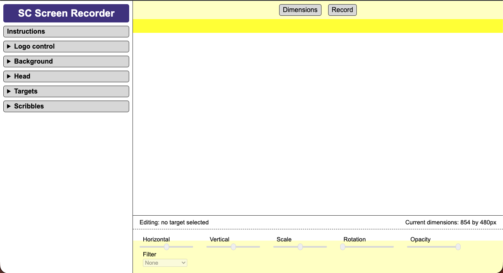

# Scrawl-canvas picture editor

A browser-native picture editing studio.

- TODO: 3-5 bullpoints giving the top level overview of the tool  

<table>
<tr>
<td width="100%">
 
An image gallery of max 6 images showing what we've just told above. Could be replaced by a short video
</td>
</tr>
</table>

**Try it now:** TODO: link to the GitHub page where we're hosting the proof of concept

## Key Features

### Key feature 1

TODO: short paragraph describing key feature 1

### Key feature 2

TODO: short paragraph describing key feature 2

TODO: add key feature paragraphs, as required

## Primary Use Cases

### Primary use case 1

TODO: short paragraph describing primary use case 1

### Primary use case 2

TODO: short paragraph describing primary use case 2

### Other Possible Uses

- TODO: short list of other possible use cases

## Privacy by Design

This tool uses standard browser media APIs. Everything happens inside the browser:
- No data is uploaded anywhere
- No accounts are required
- No analytics or tracking scripts
- Processed images are saved locally

---

# Technical details

The tool has been designed to be as easy as possible to run locally, and to hack to meet individual or small business requirements (when hosted on their own infrastructure)

## Under the Hood

The project is intentionally simple:
- Vanilla **JavaScript, HTML and CSS**
- No frameworks
- No build process
- Entirely client‑side

The visual composition layer is powered by the [Scrawl‑canvas graphics library](https://github.com/KaliedaRik/Scrawl-canvas).

TODO: list the other 3rd party tech used in the site (eg: wasm code)

## Self Hosting the Web Page

The project can be run locally or hosted on any static web server. There are no dependencies, build steps, or installation processes. Simply clone or fork the repository and serve the files.

## Running the Web Page Locally

1. Clone or download the repository.
2. Navigate to the project folder.
3. Start a local web server - for example using https://github.com/tapio/live-server
4. Open the page in a modern desktop browser.

Because the tool uses browser media APIs, it must be served via HTTP rather than opened directly from the filesystem.

## Key Files

- `index.html` - Defines the interface and layout of the application.
- `index.css` - Handles styling and layout.
- `index.js` - Contains the application logic — screen capture, canvas composition, recording, teleprompter functionality and device management.
- `js/scrawl.js` - The minified Scrawl‑canvas library used for canvas graphics and compositing.
- TODO: list other key files

## Project Philosophy

TODO: a short section covering the underlying philosophy

## Known Issues

The tool depends on modern browser media APIs and therefore has some limitations.

TODO: list known issues across browsers, and for individual browser/device combinations etc
