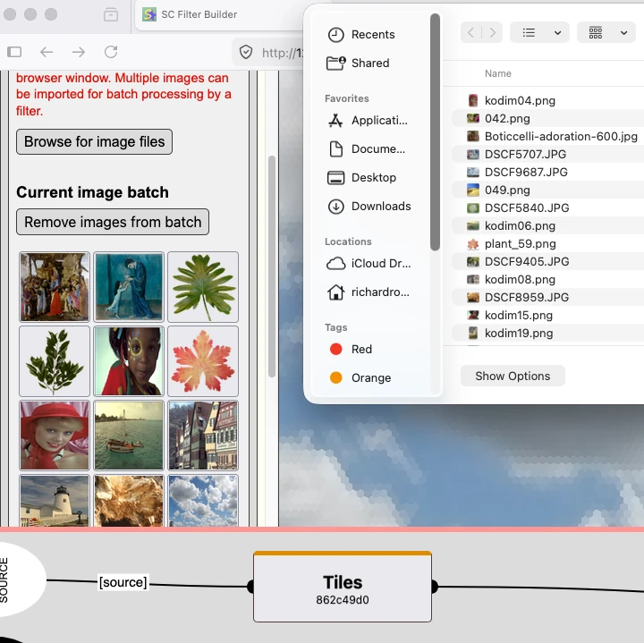
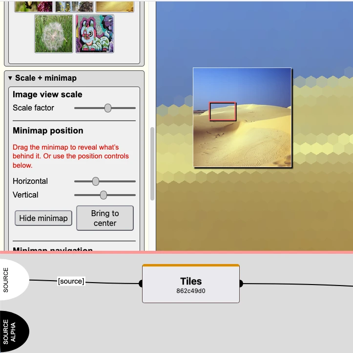
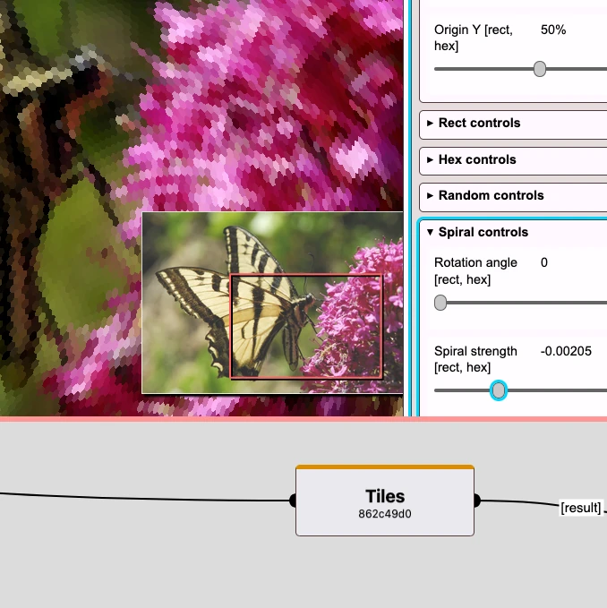
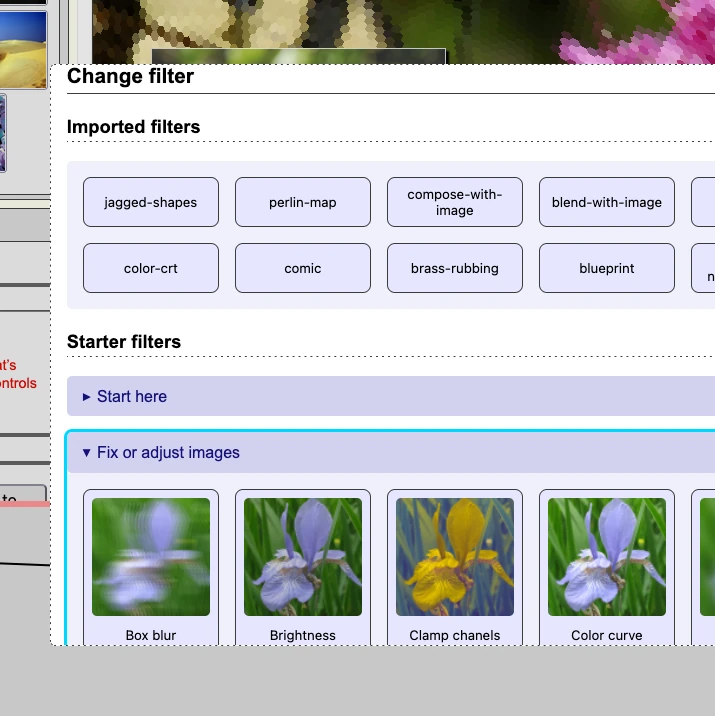
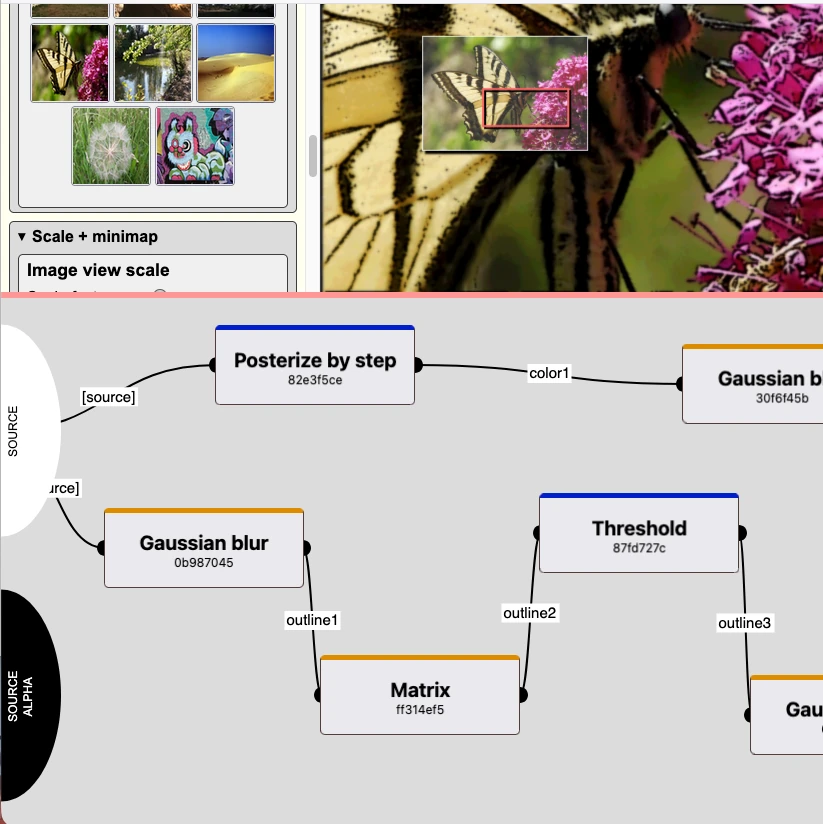
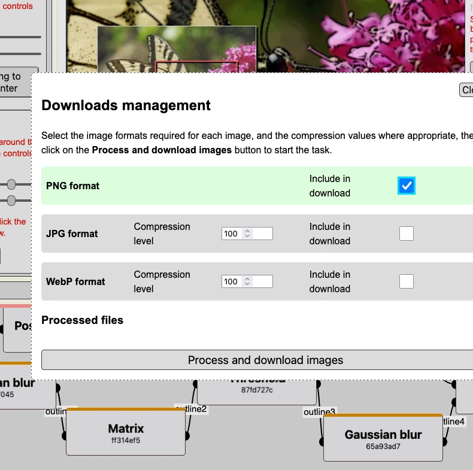

# Scrawl-canvas filter builder

A browser-native, local-only image filter builder powered by the Scrawl-canvas filter engine.

**Try it:** [SC Filter Builder on GitHub pages](https://kaliedarik.github.io/sc-filter-builder/)

## What it does

- Build reusable image filters as chains of composable actions  
- Preview their effect across multiple images (non-destructive)  
- Export processed images in batches (no uploads, no backend)

<table>
<tr>
<td width="33%">
 
Filter builder UI - image import
</td>
<td width="33%">
 
Filter builder UI - minimap pan and scale
</td>
<td width="33%">
 
Filter builder UI - filter editing controls
</td>
</tr>
<tr>
<td width="33%">
 
Filter builder UI - import and change filters
</td>
<td width="33%">
 
Filter builder UI - filter actions graph
</td>
<td width="33%">
 
Filter builder UI - batch process images
</td>
</tr>
</table>

### Why this exists

This tool serves two key purposes:

1. A practical UI for building and refining image filters  
2. A way to apply those filters consistently across multiple images

Once built, a filter can be reused across any number of images, making it easy to standardise visual output.

This tool complements traditional editors and node-based systems by offering a lightweight, browser-native approach to building and applying reusable filters.

## Key features

### Filter graph with explicit data flow

Each filter action defines how it connects to others (`lineIn`, `lineOut`, `lineMix`).  
The graph visualises this flow and updates as you edit the filter.

This makes it possible to understand how image data moves through the system, debug broken chains, and experiment with non-linear compositions.

### Real-time preview (approximate + accurate)

- **Fast preview**: processes only visible regions for responsiveness  
- **Accurate preview**: applies the full filter for correctness  

This distinction becomes important for large images and complex filters.

### Batch processing (with live preview)

Import multiple images to:

- see how a filter behaves across different inputs  
- tweak the filter and watch all previews update in real time  
- export processed images in one go  

### Fully local, no backend

The tool follows a local-first approach. It has no backend, no build step, and no runtime dependencies beyond the bundled libraries.

Released under the MIT licence, it can be forked and adapted as needed. The interface is built using plain HTML, CSS, and modular JavaScript.

### Serializable filters (packet system)

Filters can be exported to the user's local device as text packets, ready for importing into future sessions. Packets can also be shared as standalone filter definitions (including embedded assets).

## Primary use cases

### 1. Batch image processing with custom filters

Build a filter once, then apply it across multiple images. This is useful for:

- consistent styling across a set of images; 
- generating variations quickly; and
- lightweight, repeatable image workflows.  

### 2. Filter development and experimentation

Build and refine filter chains visually while working with the underlying data model. This is particularly useful for experimenting with multi-step filters, colour-space investigations (OKLab/OKLCH, etc), and developing compositing and blending pipelines.

### Example workflow

1. Import a set of images  
2. Build a filter (for example: tone curve → tint → sharpen)
3. Adjust the filter while previewing the results across all images  
4. Export the processed images in one batch  

This makes it easy to apply consistent styling across a collection of images without relying on external tools.

## Technical details

Under the hood, the tool runs on vanilla **JavaScript, HTML, CSS**. It uses no framework and avoids Node dependencies and build steps. The code runs entirely client-side, in the browser.

The tool is powered by [Scrawl-canvas](https://github.com/KaliedaRik/Scrawl-canvas) (rendering + filter engine).

### Privacy by design

Everything happens inside the browser: no data leaves your machine — there is no analytics or tracking code, and no external services are called by the tool. Processed images are downloaded directly to your device.

### Running locally

1. Clone or download the repository  
2. Start a local web server (e.g. https://github.com/tapio/live-server)  
3. Open the page in a modern browser  

Note that the tool must be served over HTTP — it will not work from `file://`

### Self-hosting

This is a static site. You can host it on:

- GitHub Pages  
- Any static hosting provider  
- Local infrastructure  

No configuration required.

### Project philosophy

- **Client-first** — no servers, no uploads  
- **Transparent** — show the system, not hide it  
- **Composable** — small actions, chained together  
- **Hackable** — simple structure, easy to fork  

This is a tool for exploration, prototyping, and lightweight production workflows.

### Known issues

- Browser-dependent canvas limits (large images may fail)
- Preview may differ from final output for some filters
- Some filter combinations will produce broken graphs (by design — not everything self-heals)
- Performance varies significantly with image size and filter complexity
